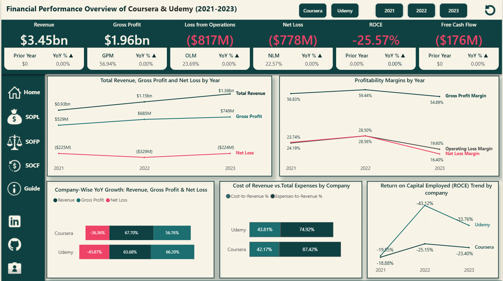
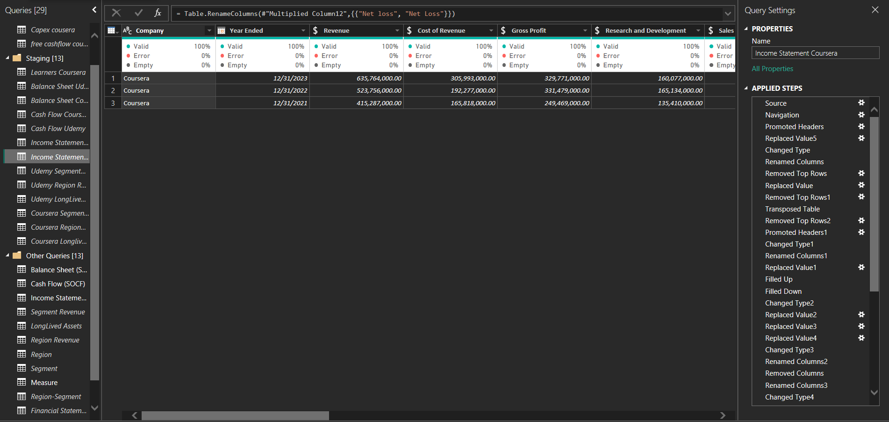
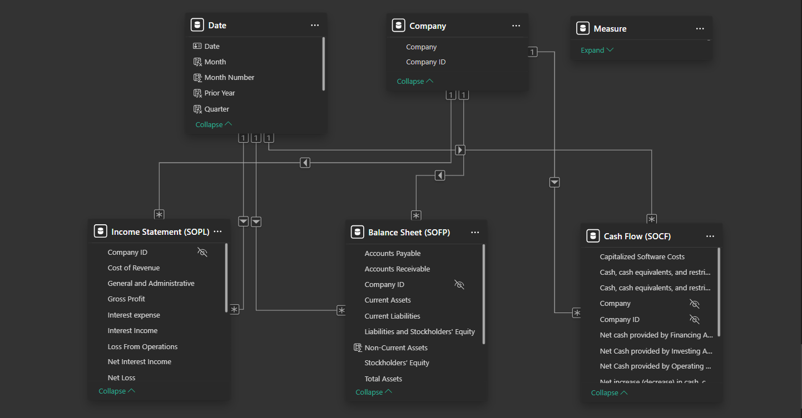

# Financial-Analysis-of-Coursera-and-Udemy-(2021-2023)
## Project Goal
This financial statement analysis compares Coursera and Udemy over the three year fiscal period from 2021 to 2023. The objective is to evaluate each company's financial performance by examining their Income Statements (SOPL), Balance Sheets (SOFP), and Statements of Cash Flows (SOCF). Through detailed ratio analysis, trend evaluation, and performance benchmarking, this project aims to determine which company is financially stronger and highlight areas where each can improve. 

# Table Of Contents
* Installation
* About the Project
* The Data Set
* The Data Cleaning
* The Data Model
* Insights
* Recommendation
* Limitation

# Installation 
The project requires:
* `Power BI` for extracting, transforming, and loading (ETL) data, as well as for data cleaning, visualization, and storytelling.

# About The Project 
This project provides a detailed financial analysis of two leading online learning platforms, Coursera and Udemy, covering the fiscal years 2021 to 2023. It evaluates and compares both companies' financial performance using key indicators from Statement of Profit or Loss (Income Statements), Statement of Financial Position (Balance Sheets), and Statements of Cash Flows. The goal is to access which company is demonstrating stronger financial health, operational efficiency, and growth potential, while also highlighting areas of concern or opportunities for improvement. The findings are supported by clear visualizations and simplified commentary to make the analysis both insightful and easy to understand.

# The Data Set 
The dataset used in this analysis was obtained directly fron the official websites of Coursera and Udemy. These datasets include publicly available raw financial reports such as income statements, balance sheets and cash flow statements, published for the fiscal years 2021, 2022 and 20223. I applied ETL (Extract, Transform, Load) processes, utilizing tools like Power BI to efficiently extract, clean, transform, and load the data. This preparation ensured the datasets were ready for analysis and visualization to enable meaningful comparison and accurate insight generation.

# The Data Cleaning

To prepare the financial data for analysis, I performed several key data cleaning and transformation:

* Duplicated tables to preserve original data before applying transformations.

* Ensured that the first row of data is used as the header for better clarity.

* Adjusted the data types to ensure accurate analysis and compatibility with Power BI.

* Transposed tables to restructure the layout for easier comparison and analysis.

* Added new calculated columns to facilitate deeper insights.

* Addressed missing data by replacing null values appropriately.

* Removed unwanted columns and eliminated duplicate entries to refine the dataset.

* Trimmed unnecessary whitespace from the dataset for cleaner data presentation.

* Standardized column names, date formats, and currency to maintain consistency throughout the dataset.

* Merged similar financial statements from Coursera and Udemy into a unified tables for side by side comparison.

* Created supporting tables, including a date table to ensure time based filtering and trend analysis in visualizations.

* Conducted data profiling to ensure quality assurance and identify any data anomalies on the entire dataset.

# The Data Model

I established a downward flow data model to ensure a seamless connection between the fact tables and dimension tables. For this model, I employed a Star Schema for all tables. The relationships between the tables were established based on the primary and foreign keys, adopting a one-to-many cardinality with a single cross-filter direction. Additionally,  I designated the primary key in each table as the key column and hid all foreign keys to streamline the model and enhance clarity.

# Insights
After performing data cleaning and thoroughly analyzing the financial statement of both Coursera and Udemy, I uncovered several key insights:

## Statements of Profit or Loss (Income Statements) Analysis of Coursera and Udemy

_Report.png)
Over the past three years, Udemy recorded higher revenues than Coursera, generating approximately $516 million in 2021, $629 million in 2022, and $729 million in 2023, compared to Coursera’s revenue of $415 million in 2021, $524 million in 2022, and $636 million in 2023. Likewise, over the same period, Udemy consistently recorded a higher gross profit than Coursera, driven by its higher revenue base. However, Coursera maintained a more efficient cost structure, as reflected in its lower cost-to-revenue ratio of 42.17%, compared to Udemy’s 44.81%. This indicates that although Udemy generates more revenue, Coursera is relatively better at managing its direct costs.

Looking at Gross Profit Margin (GPM) trends, Coursera initially had stronger margins of 60.07% in 2021 and 63.29% in 2022 compared to Udemy’s 54.23% and 56.24%, respectively. However, in 2023, Coursera’s GPM dropped sharply to 51.87%, while Udemy improved to 57.53%. This improvement for Udemy, despite a higher absolute cost of sales of approximately $310 million, can be attributed to its stronger revenue performance of approximately $729 million, which outpaced the increase in cost of revenue resulting in a more favorable gross profit margin.

Over the past three years, both Udemy and Coursera have consistently reported losses, but Udemy recorded lower losses from operations and net loss compared to Coursera. This is reflected in their Operating Loss Margin (OLM) and Net Loss Margin (NLM). In 2023, for instance, Udemy had an OLM of 16.72% and an NLM of 14.72%, while Coursera recorded a higher OLM of 22.90% and an NLM of 18.33%. This difference also aligns with their expense-to-revenue ratios, where Udemy’s stood at 74.92%, while Coursera’s was 87.42%. Even though Coursera recorded lower total expenses in 2023, it still had higher losses from operations and net loss, indicating that its revenue performance wasn’t strong enough to absorb its cost structure efficiently.

Between 2021 and 2022, both Coursera and Udemy experienced notable top-line growth. Coursera saw a 26.12% increase in revenue and a 32.87% rise in gross profit, while Udemy recorded a revenue growth of 22.00% and a 26.51% increase in gross profit in 2022. Additionally, both companies experienced an increase in net losses between 2021 and 2022, indicating that their financial performance worsened that year despite revenue and gross profit growth. Specifically, Udemy’s net loss widened significantly by 92.28%, showing that while revenue and gross profit rose by 22.00% and 26.51% respectively, the company’s expenses increased at a faster rate, deepening losses. Coursera also recorded a 20.76% increase in net loss, despite 26.12% growth in revenue and 32.87% in gross profit. This shows that improved top-line performance did not translate to bottom-line efficiency in that year.

However, in 2023, the narrative shifted slightly. Coursera maintained stronger revenue growth at 21.39% compared to Udemy’s 15.87%, but its gross profit declined by 0.52%, while Udemy’s gross profit rose by 18.53%.
In terms of net loss, from 2022 to 2023, both companies reversed the negative trend and significantly reduced their net losses. Coursera’s net loss improved by 33.53%, despite only a modest increase in revenue and a slight dip in gross profit, while Udemy recorded a 30.27% improvement in net loss alongside continued growth in revenue and gross profit.
This shift reflects stronger cost control or better operational efficiency in 2023 and supports earlier insights that, although both companies still operate at a loss, they are now on a clearer path toward financial sustainability.

The top three expense categories for both companies from 2021 to 2023, as a percentage of total expenses, remain consistent: Sales & Marketing (S&M), General & Administrative (G&A), and Research & Development (R&D). However, their allocation strategies reflect different priorities.
Coursera consistently allocates a higher proportion of its total expenses to Research & Development, dedicating 34.5% in 2021, 32.45% in 2022, and 33.67% in 2023 indicating a strong focus on innovation and platform development. Meanwhile, Udemy’s R&D allocation is noticeably lower, though gradually increasing from 18.49% in 2021 to 22.23% in 2023.
Conversely, Udemy places more emphasis on Sales & Marketing, spending 63.50% in 2021, 59.68% in 2022, and 58.52% in 2023. Coursera’s Sales & Marketing expenses are relatively lower, though consistent, ranging from 45.69% to 46.86% over the same period. Udemy’s higher investment in Sales & Marketing suggests a stronger focus on market expansion and customer acquisition strategies.

General & Administrative (G&A) expenses remain fairly stable for both companies, with Coursera maintaining around 20% and Udemy slightly lower, between 17% and 19.6%.

Return on Capital Employed (ROCE) further highlights Udemy’s financial struggles. Over the years, Udemy recorded a more negative ROCE: -19.55% in 2021, -43.12% in 2022, and -33.76% in 2023 compared to Coursera’s ROCE of -18.88%, -25.15%, and -23.40%, respectively. This indicates that Udemy has been less efficient in utilizing its capital to generate returns, suggesting its invested capital is not yielding sufficient gains and reinforcing its weaker financial sustainability despite reporting lower losses than Coursera.

## Statement of Financial Position (Balance Sheet) Analysis of Coursera and Udemy
_Analysis.png)
From 2021 to 2023, Coursera consistently maintained a stronger equity position compared to Udemy. Coursera’s total equity declined from approximately $742M in 2021 to $616M in 2023, reflecting the cumulative effect of recurring net losses over the years. Although its equity shrank, Coursera still retained a relatively healthy capital structure, with liabilities accounting for just 33% of total assets in 2023. Udemy, on the other hand, recorded a smaller equity base throughout the same period dropping from approximately $390M in 2021 to $339M in 2022, before slightly improving to $357M in 2023. This rebound in equity aligns with the reduced net loss recorded in 2023.
However, Udemy operates with a higher leverage profile: in 2023, its liabilities accounted for approximately 52% of total assets compared to Coursera’s 33%, indicating a heavier reliance on external obligations which is further reflected in its higher debt-to-equity ratios.

Coursera appears to be largely equity-financed, as seen in its low debt-to-equity ratios ranging from 0.29 to 0.49 between 2021 and 2023. This suggests a conservative capital structure with greater financial flexibility. This is further supported by its strong current ratios, ranging from 4.44 to 2.79, and high working capital levels indicating a robust short-term liquidity position. In contrast, Udemy relies more heavily on debt financing, with significantly higher debt-to-equity ratios ranging from 0.90 to 1.17 between 2021 and 2022, reducing slightly to 1.08 in 2023. This implies greater financial leverage and associated financial risk. Its relatively lower current ratios ranging from 1.88 to 1.66 and lower working capital indicate constrained liquidity. Together, these metrics suggest that while Coursera may be more resilient in sustaining operations without external borrowing, Udemy may be under more pressure to generate consistent cash flows to meet its obligations.

Both companies maintained a relatively stable asset base, but while Coursera’s asset value declined slightly from approximately $959M in 2021 to $921M in 2023, Udemy’s total assets remained almost unchanged. Although both companies consistently recorded purchases of property, equipment, and software each year indicating ongoing investment. The gradual decline in Coursera’s asset base suggests these investments were likely aimed at maintaining or upgrading existing operations rather than pursuing significant expansion.

Over the three years, Coursera consistently held higher current assets (CA) compared to Udemy, suggesting stronger short-term liquidity. Conversely, Udemy maintained higher non-current assets (NCA), indicating greater investment in long-term operational capacity. On the liabilities side, Udemy recorded higher current liabilities (CL), while Coursera held more non-current liabilities (NCL) reflecting differing approaches to financing and debt maturity structures.

## Statement of Cash Flow Analysis of Coursera and Udemy
_Report.png)
Over the three-year period, both Coursera and Udemy displayed varying cash flow dynamics that reflect their operational stability, investment patterns, and financing strategies.

In 2021, both companies generated strong inflows from financing activities due to their Initial Public Offerings (IPO). Coursera raised approximately $550M, while Udemy generated around $419M. However, both companies recorded negative free cash flow (FCF), indicating that operating cash was insufficient to cover capital expenditures. Despite this, Coursera ended the year with a solid net cash flow of approximately $500M, supported by a modest $2M in operating cash flow. Udemy, with a negative operating cash flow of about -$7M, still posted a net cash flow of approximately $359M, largely due to the heavy financing inflows.

In 2022, both companies experienced steep declines in operating cash flow. Coursera’s operating cash flow declined to approximately -$38M, and Udemy’s dropped further to around -$61M, signaling operational inefficiencies in the year. At the same time, both companies experienced increased investment outflows, with Coursera spending about -$234M and Udemy approximately -$173M, driven mainly by purchases of marketable securities, acquisitions, and asset purchases. With financing inflows dropping sharply, both companies posted significant negative net cash flows: Coursera at approximately -$260M and Udemy at around -$219M, reflecting weakened cash positions.

In 2023, Coursera showed notable improvement, turning its operating cash flow positive to approximately $30M and reporting a strong net cash flow of about $335M. This improvement was largely driven by a significant inflow in investing activities amounting to approximately $385M, primarily from the maturities of marketable securities. Udemy also made progress by reducing its operating cash flow loss to approximately -$2M and decreasing its investment outflows to around -$25M, which led to a modest net cash outflow of approximately -$8M.

Both companies benefited in 2023 from the maturity of marketable securities, which contributed to their positive investing cash flow figures. Coursera recorded approximately $530M, while Udemy reported $296M proceeds from marketable securities, helping to stabilize their overall cash positions.

Overall, Coursera demonstrated stronger recovery in 2023, showing greater efficiency in managing its operations and investments. Both companies experienced negative free cash flow in 2021 and 2022, reflecting a reliance on external financing and a reinvestment-heavy strategy over short-term profitability. However, in 2023, Coursera achieved a positive free cash flow of approximately $8M, suggesting a potential shift toward operational self-sufficiency and improved cash management. Udemy, while still posting negative free cash flow in 2023, significantly reduced its deficit, indicating progress toward financial stability.

# Recommendations for Coursera
Coursera should focus on the following areas to optimize its performance:
* **Capitalize on Operational efficiency Gains:**
Coursera achieved a positive free cash flow in 2023, indicating improving operational efficiency. To sustain this momentum, the company should continue optimizing costs especially in sales and Marketing which consistently accounts for nearly half of its total expenses.

* **Maximize ROI on Research and Development Investments:**
With Coursera consistently spending a larger share of expenses on R&D compared to Udemy, it should ensure that these investments translate into measurable service(product) enhancements and user growth.

* **Maintain Conservative Capital Structure:** 
Coursera has a strong equity base and low debt-to-equity ratio, which positions it well for long-term stability. It should continue leveraging this conservative capital structure but can explore prudent use of low-cost debt for strategic expansion or tech infrastructure improvement.

* **Improve Asset Utilization:**
Despite regular capital investments in PPE and software, Coursera's total assets have declined. This suggests potential underutilization or high depreciation. The company should evaluate asset productivity and explore better ways to deploy its resources.

# Recommendations for Udemy
Udemy should focus on the following areas to optimize its performance:
* **Enhance Cash Flow Management:**
Udemy has consistently reported negative operating and free cash flow which  may pressure liquidity. The company should focus on reassessing its revenue model, pricing strategy or cost control to move toward cash flow positivity.

* **Rebalance Capital Structure:**
With a relatively high debt-to-equity ratio and negative free cash flow, Udemy needs to work on reducing reliance on external financing. While this can accelerate growth, it also increases financial risk. Therefore, improving equity financing or reducing debt would strengthen the company's balance sheet.

* **Rebalance Expense Structure:**
Udemy allocates over 60% of its total expenses to sales and marketing. Management should access the return on this investment to ensure it is driving sustainable user acquisition and retention.

# Joint Recommendations for both Companies
* Both companies should continue to monitor and optimize their expense allocation, particularly balancing customer acquisition (S&M) and product innovation(R&D)

* Clearly communicate how ongoing investments especially in intangible assets like software support future growth and competitive advantage.

# Limitations
A key limitation of this analysis is that it does not incorporate broader macroeconomic factors such as inflation, interest rate fluctuations, or potential recessionary pressures, all of which could significantly affect cost structures and revenue growth. Additionally, while comparing Coursera and Udemy yields meaningful insights, the absence of benchmarking against industry averages or other competitors limits the ability to assess their relative performance. Lastly, the analysis is based on aggregated company-level financial data, without segment-level breakdowns, which may hide important differences in how each company performs in their various markets and products.

# Licensing And Authors
This code was created by Sandra Obanijesu under the GPL-3.0 license. Please feel free to use the resources as you deem fit.
